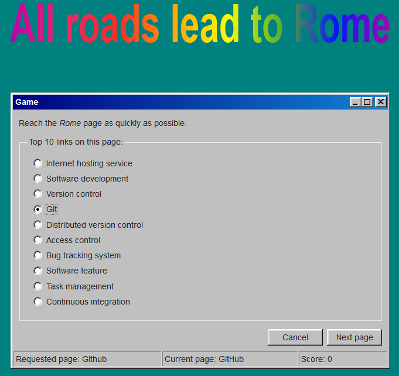

# All roads lead to Rome
This is a web app built in Python with `Flask`. It implements a simple Wikipedia game.

## The goal
The goal of the game is to find the Wikipedia page for the article 'Rome' as fast as possible. You start by giving the page from which you wish to start. The app then lists the first 10 link form the page that you chose. You select one of the links and hit 'Next page' to go to the corrresponding page. The game end when you reach the page for 'Rome'.

## How to run it
- Copy this repo (`git clone`)
- Install the requirements (`pip install -r requirements.txt`)
- (Optional) Modify the content of the `.secretkey` file to add your own key
- Launch the script `server.py`
- Go to `localhost:5000` with you browser

## Credits
- The CSS theme is a modified copy of the [98 CSS theme](https://github.com/jdan/98.css). Folders `static/docs` and `static/icon` and the file `static/98.css` contain code and folders taken from this project.
- The Word Art inspired title has been adapted from [this source](https://www.designpieces.com/2017/03/wordart-css3-text-effects/).